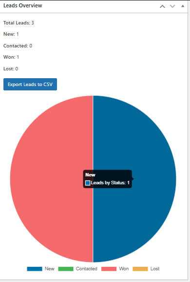
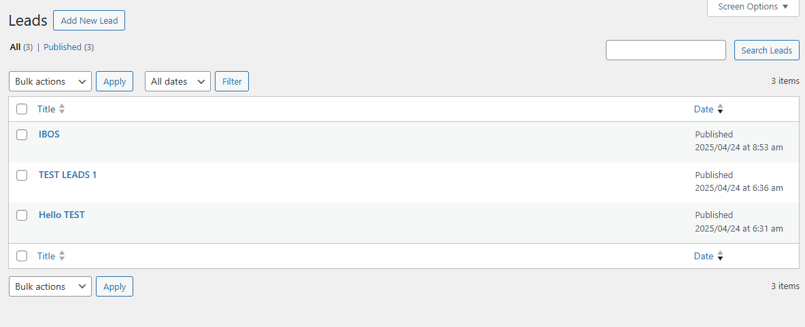
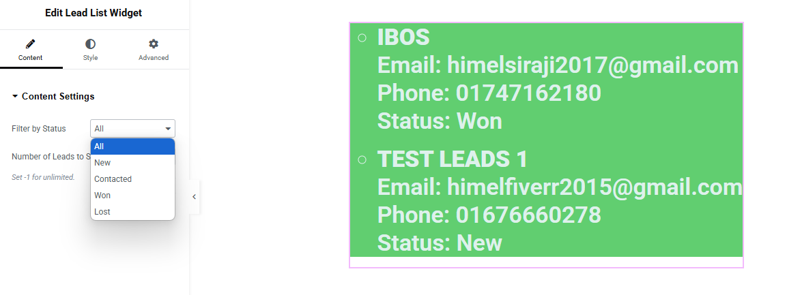

# 🧩 Simple WP CRM

A lightweight CRM plugin for WordPress with:

- ✅ Custom Post Type (CPT) for Leads
- ✅ Meta Boxes for Email, Phone, Status
- ✅ REST API with status filtering (`?status=won`)
- ✅ Admin Dashboard Overview Widget (Total, Status Count)
- ✅ CSV Export Button from Dashboard
- ✅ Dynamic Chart with Chart.js
- ✅ Elementor Integration: Display Leads on frontend
- ✅ Filter Leads by Status inside Elementor
- ✅ Control number of Leads to show
- ✅ Full Style Controls (Typography, Color, Padding)

---

## 📦 Features

| Feature         | Details                                     |
|-----------------|---------------------------------------------|
| CPT             | Registers a `lead` post type with title, content |
| Meta Fields     | Email, Phone, Status (stored in postmeta)   |
| REST API        | Endpoint at `/wp-json/simple-crm/v1/leads` (with filter support) |
| Dashboard Widget| Shows total leads + statuses + CSV export |
| CSV Export      | Download all leads data as CSV |
| Chart.js        | Visual Pie Chart showing Lead Status overview |
| Elementor Widget| Display dynamic Leads list on frontend, fully customizable |

---

## 🧪 How to Use

1. Upload the plugin folder `simple-wp-crm` to `/wp-content/plugins/`
2. Activate the plugin via WP Admin → Plugins
3. Go to **Dashboard → Leads Overview** to:
   - View lead stats
   - Export CSV
   - See pie chart
4. Go to **Leads** → Add New to manage lead entries
5. In Elementor, search for "**Lead List Widget**" to show leads dynamically:
   - Filter by Status (New, Contacted, Won, Lost)
   - Set number of leads to display
   - Style text, background, padding responsively

---

## 🔌 REST API Endpoints

- Get all leads:
GET /wp-json/simple-crm/v1/leads

- Get leads by status:
GET /wp-json/simple-crm/v1/leads?status=won

---

## 🧩 Elementor Integration

This plugin now includes a fully functional Elementor Widget:

- Display dynamic Leads list
- Filter by Lead Status (New, Contacted, Won, Lost)
- Control number of leads displayed
- Full style controls (Typography, Color, Padding)

Available inside Elementor editor as:  
**"Lead List Widget"**

---

## 📷 Screenshots

### 1. Dashboard Widget (Chart, Stats, Export)

### 2. Leads List in Admin

### 3. Lead Entry Form with Custom Meta

### 4. Elementor Widget - Filter by Status

---

## 📁 Folder Structure

simple-wp-crm/ ├── js/ │ └── swcrm-dashboard-chart.js ├── widgets/ │ └── class-lead-list-widget.php ├── simple-wp-crm.php ├── README.md ├── screenshot-dashboard.png ├── screenshot-leads-list.png ├── screenshot-lead-form.png ├── filter-screenshots.png ├── screenshot-leads-style-color.png

---

## 👨‍💻 Author

Built and maintained by [Siraji](https://github.com/sirajiwpdev)

Feel free to ⭐ star the repo if you find it useful or contribute!

---

## 📜 License

GPLv2 or later — free for modification and distribution under GPL.

---
