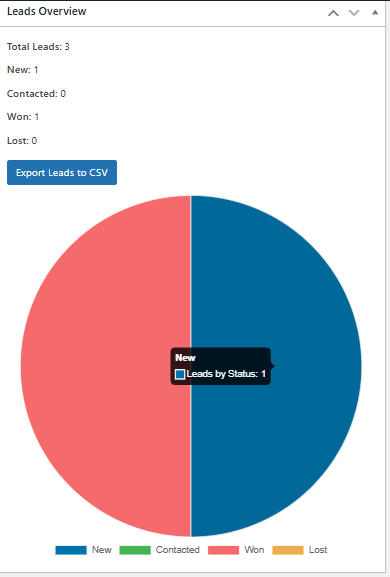
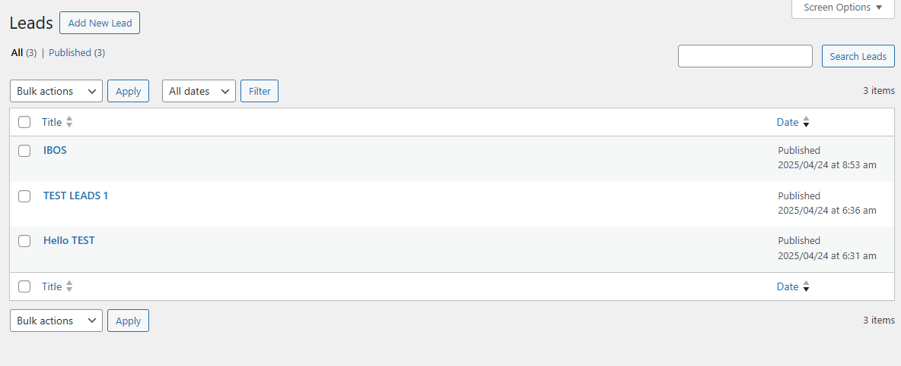
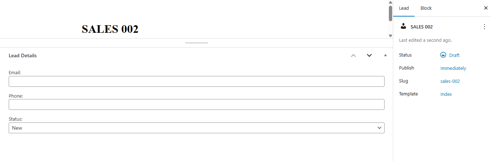

# 🧩 Simple WP CRM

A lightweight CRM plugin for WordPress with:

- ✅ Custom Post Type for Leads
- ✅ Meta Boxes for Email, Phone, Status
- ✅ REST API with filtering (`?status=won`)
- ✅ Admin Dashboard Overview Widget
- ✅ CSV Export Button
- ✅ Pie Chart via Chart.js (visual analytics)

---

## 📦 Features

| Feature         | Details                                     |
|-----------------|---------------------------------------------|
| CPT             | Registers a `lead` post type with title, content |
| Meta Fields     | Email, Phone, and Status stored in postmeta |
| REST API        | Endpoint at `/wp-json/simple-crm/v1/leads` with status filtering |
| Dashboard Widget| Shows total & status count, includes chart & export |
| CSV Export      | Exports leads to CSV from dashboard |
| Chart.js        | Pie chart of leads by status (inside dashboard widget) |

---

## 🧪 How to Use

1. Upload the plugin folder `simple-wp-crm` to `/wp-content/plugins/`
2. Activate the plugin via WP Admin > Plugins
3. Go to **Dashboard → Leads Overview** to:
   - View stats
   - Export to CSV
   - See pie chart
4. Visit **Leads** menu to manage lead entries

---

## 🔌 REST API Example

Get all leads:
GET /wp-json/simple-crm/v1/leads

Get leads by status:

GET /wp-json/simple-crm/v1/leads?status=won

---

## 📷 Screenshots

### 1. Dashboard Widget (Chart, Stats, Export)

### 2. Lead List (CPT Admin)

### 3. Lead Entry Form (Meta Fields)

---

## 📁 Folder Structure

simple-wp-crm/ ├── js/ │ └── swcrm-dashboard-chart.js ├── simple-wp-crm.php └── README.md

---

## 👨‍💻 Author

Created by [Siraji](https://github.com/sirajiwpdev)

If you found this helpful, ⭐ star the repo or share it!

---

## 📜 License

GPLv2 or later — open-source, modify as needed.
